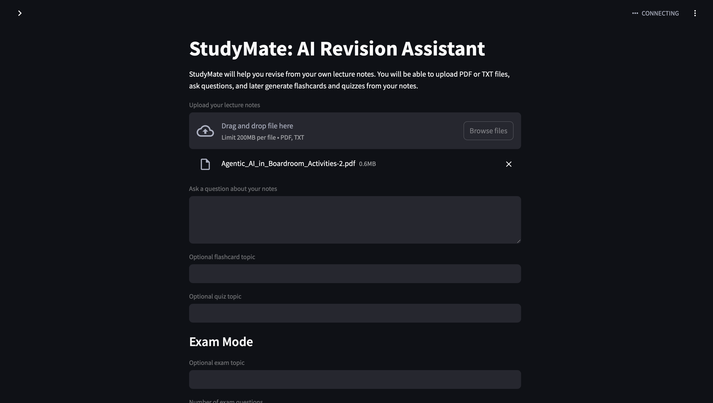

# StudyMate: AI Revision Assistant

StudyMate is a LangChain + Streamlit RAG application that helps students study from their own lecture notes. Users can upload PDF or TXT notes, ask questions, generate flashcards, create quizzes, and use Exam Mode for deeper practice.

The project is designed to be beginner-friendly while still showing a real end-to-end AI workflow: document loading, chunking, embeddings, vector search, retrieval, and grounded answer generation.

## Screenshots



## Features

- Upload lecture notes as PDF or TXT files
- Extract text from uploaded files
- Split long notes into smaller RAG-friendly chunks
- Create OpenAI embeddings for note chunks
- Store and search chunks with ChromaDB
- Ask questions about uploaded notes
- Answer using retrieved notes instead of guessing
- Show source chunks used for answers
- Generate flashcards from the notes
- Generate mixed quiz questions
- Generate Exam Mode questions with model answers
- Show beginner-friendly error messages for missing files, missing API keys, unreadable PDFs, and vector store issues

## Tech Stack

- Python
- Streamlit
- LangChain
- langchain-openai
- ChromaDB / langchain-chroma
- pypdf
- python-dotenv
- pytest

## How It Works

1. A user uploads a TXT or PDF file.
2. StudyMate extracts readable text from the file.
3. The text is split into smaller chunks.
4. Each chunk is converted into an embedding.
5. The embeddings and chunks are stored in ChromaDB.
6. When the user asks a question, StudyMate retrieves the most relevant chunks.
7. ChatOpenAI answers using only those retrieved chunks.
8. The app displays both the answer and the source chunks.

## RAG Pipeline Explanation

RAG means Retrieval-Augmented Generation. Instead of asking the AI model to answer from memory, StudyMate first retrieves relevant information from the uploaded notes.

The pipeline is:

```text
Uploaded notes
-> text extraction
-> chunking
-> embeddings
-> Chroma vector store
-> similarity search
-> prompt with retrieved notes
-> grounded AI answer
```

This helps reduce made-up answers because the model is instructed to use only the notes retrieved from the vector store.

## Installation

Clone the project and move into the folder:

```bash
git clone <your-repo-url>
cd studymate-rag-assistant
```

Create a virtual environment:

```bash
python3 -m venv .venv
```

Activate the virtual environment:

```bash
source .venv/bin/activate
```

Install the requirements:

```bash
pip install -r requirements.txt
```

Create a `.env` file:

```bash
cp .env.example .env
```

Open `.env` and replace `your_api_key_here` with your real OpenAI API key.

Do not commit your `.env` file.

## How To Run The App

Start the Streamlit app:

```bash
streamlit run app.py
```

Then open the local URL shown in the terminal.

For a quick demo, upload:

```text
sample_data/sample_notes.txt
```

## How To Run Tests

Run the test suite with:

```bash
python3 -m pytest -q
```

The tests are designed to avoid real OpenAI API calls.

## Example Questions

After uploading `sample_data/sample_notes.txt`, try:

- Explain binary search in simple terms
- Make me 5 flashcards about Big O notation
- Create an exam quiz about recursion
- What are the key differences between arrays and linked lists?

## What I Learned

LangChain helps connect different parts of an AI application, such as prompts, models, retrievers, embeddings, and vector stores. In StudyMate, it helps organize the RAG workflow.

RAG means Retrieval-Augmented Generation. It combines search with generation: first the app retrieves relevant note chunks, then the model uses those chunks to answer.

Embeddings are numerical representations of text. They allow the app to compare meaning, not just exact words, which makes it possible to find relevant notes for a question.

A vector store is a database for embeddings. StudyMate uses ChromaDB to store note chunks and search for chunks that are similar to the user's question.

Streamlit was used because it makes it fast to build a clean Python web app without needing a separate frontend framework. It is a good fit for demos, prototypes, and student-friendly AI tools.

## Future Improvements

- Add persistent ChromaDB storage between app sessions
- Support multiple uploaded files at once
- Add better PDF handling for scanned documents
- Add downloadable flashcards and quizzes
- Add user-selectable model settings
- Improve source citations with page numbers
- Add a cleaner multi-tab Streamlit layout
- Add deployment instructions

## AI Assistance Disclosure

I used Codex as an AI pair-programming assistant to help scaffold, debug, and review parts of this project. I reviewed and tested the final code myself.
